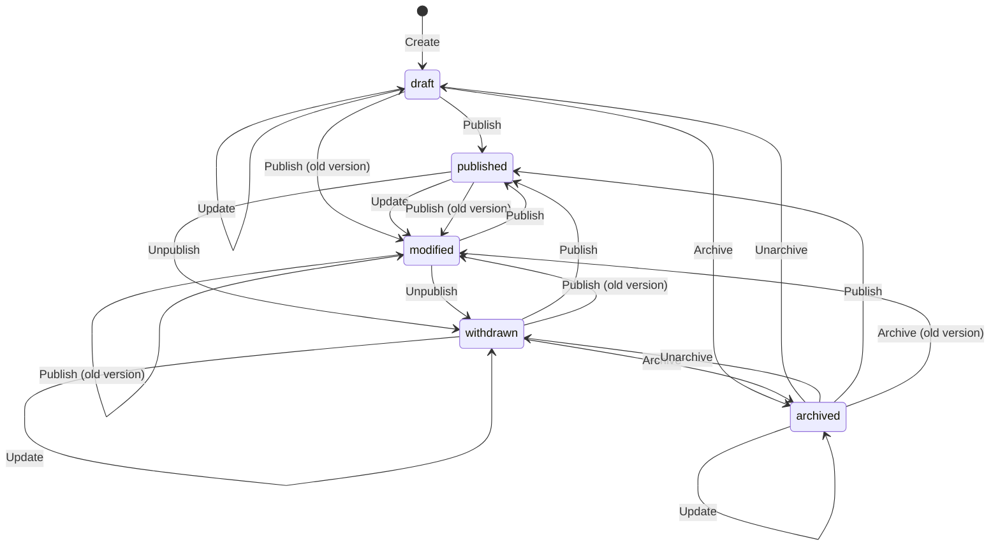

**TODO**: **Application**, **Server**

## Schema

The **Schema** describes the structure of the data stored in Dossier. There exists two different views of the Schema. **Admin Schema** contains all the information, whereas **Published Schema** only contains the types that can be published (i.e. `adminOnly` is `false`) and doesn't include detailed information that's only useful when editing.

The main piece of data is an **Entity**. An **Entity** has:

- a unique id (UUID)
- a unique name (for convenience)
- an **Entity Type**
- an **Entity Status**
- an **Authorization Key**

**TODO** Entity Type, Value item, Value Type

### Entity status

## Clients (APIs)

There are two different clients to interact with the **Server**.

**Published Client** is used to read **Published Entities** and the **Published Schema**.

**Admin Client** is used to read and modify **Admin Entities** and **Admin Schema**.

Every **Client Operation** runs through the client instance's **Client Middleware** pipeline. The pipeline is provided by the **Application**.

**Note**: Even if they are called client/server they can be run in same process.

## Authentication

A **Subject** represents an entity that accesses the data. It could be an interactive user or a program.

A **Subject** can have one or more **Principals**. It could be e.g. represent one or more OAuth identities.

There can be multiple **Principal Providers**, one for each identity provider.

The **Session Context** represents the authenticated **Subject** to the **Server**.

## Authorization

When creating an **Entity** the **Subject** provides an **Authorization Key**. The **Authorization Key** is resolved to a **Resolved Authorization Key**. The **Resolved Authorization Key** is required to access the **Entity**.

The **Application** provides an **Authorization Adapter** that 1) authorizes the **Subject** to use an **Authorization Key** and 2) resolves it to a **Resolved Authorization Key**. The **Resolved Authorization Key** can differ for different **Subjects**.
